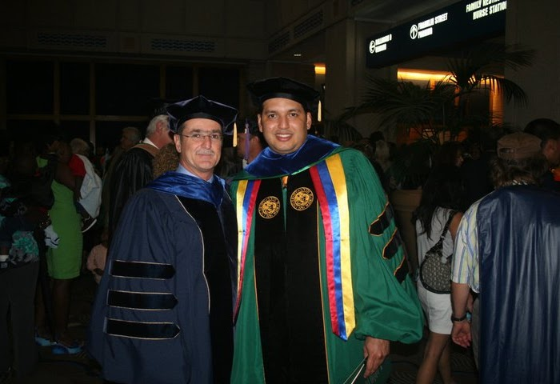

# This is the REU for Columbus State University in Cybersecurity

## What is an REU?
### NSF funds a large number of research opportunities for undergraduate students through its REU Sites program. An REU Site consists of a group of ten or so undergraduates who work in the research programs of the host institution. Each student is associated with a specific research project, where he/she works closely with the faculty and other researchers. 

## REU Objective: aims to provide appropriate and valuable educational experiences for undergraduate students through participation in research. REU projects involve students in meaningful ways in ongoing research programs or in research projects designed especially for the purpose.

# Our Research: AN EFFECTIVE APPROACH TO CLOSING THE BREACH DETECTION GAP (BDG) 

### Faculty Mentor:
- Alfredo J. Perez, Ph. D.

## How view the paper, poster, and presentation:
1. In order to view the full presentation, going to the folder `Columbus Presentation.pdf`
2. The full poster can be view by clicking on the `csuposter_davidtan.pdf`
3. The full paper can be view by clicking on the `Columbus Research Paper.pdf`

## This is my reserch paper:

## This is my research poster:

## This is my presentation:

